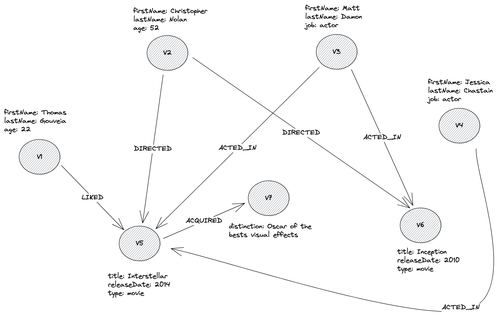

# Graph Traversal in Rust

**Disclaimer: This project was created for educational purposes.**

This repository contains the source code of a Graph traversal implementation written in Rust.

The API is based on the [Apache Tinkerpop's Gremlin](https://github.com/tinkerpop/gremlin) graph traversal language.

**Currently, the API provide only immutable steps during the traversal, such as filtering or querying edges and vertices. There is no `drop()` implementation for example, to delete one or more vertices.**

## Getting started

To run the project, simply clone the project and run the following command : 

```bash
cargo run
```

You should see an output of the example program in your console.

Open the [main.rs](./src/main.rs) file see how the API is used.

## Example Graph

Below the graph represented by the example : 


